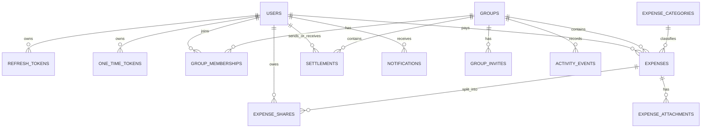
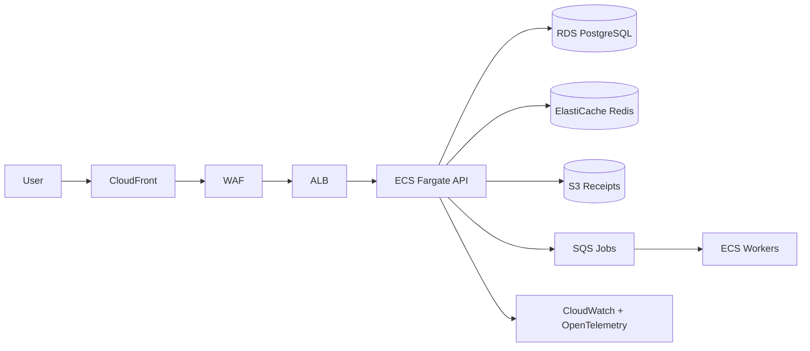

# Nivra Software Architecture Document

## 1. Product Vision

Nivra is a premium expense sharing platform built first for Indian users and designed for global scale. The product helps people create groups, add shared expenses, split bills transparently, optimize settlements, and understand spending patterns across trips, homes, families, couples, friends, and custom communities.

The north star is trust at speed: every balance should be explainable, every action auditable, and every common workflow possible in a few calm taps.

## 2. Product Requirements

Core V1 outcomes:

- Users can register, verify email, log in, refresh sessions, log out, and reset passwords.
- Users can create and manage groups with invite links and invite codes.
- Users can add expenses with receipts, categories, dates, notes, currencies, and multiple split methods.
- Users can view balances, optimized settlements, activity history, dashboard metrics, and spending trends.
- Users can record settlements through cash, bank transfer, or UPI.
- Admins can manage users, moderate abuse, view reports, and inspect platform analytics.
- The platform maintains audit trails, activity events, notification records, and security logs.

Future-ready account types:

- Family accounts
- Business accounts
- Organization accounts

Non-functional requirements:

- Mobile-first UX
- Strong consistency for money movement records
- Idempotent APIs for writes
- Structured logging, monitoring, backups, and disaster recovery
- Security controls for token rotation, RBAC, rate limiting, abuse prevention, and secrets management

## 3. Name Suggestions

| Name | Meaning | Branding potential | Why users remember it |
| --- | --- | --- | --- |
| Nivra | A calm, resolved state | Premium fintech, short, ownable | Sounds like relief after settling |
| Klearo | Clear balances | Friendly, transparent, domain-friendly | Directly implies clarity |
| Vennly | Shared circles | Social finance positioning | Links groups and money visually |
| Setlo | Settle fast | Simple consumer fintech | Verb-like and easy to say |
| Lendro | Lending and owing loop | Global fintech tone | Sounds financial without being cold |
| Ovika | Owes and value | Distinct, app-like | Soft, memorable syllables |
| Hisa | Short form of hisaab | India-first cultural signal | Familiar meaning with modern shape |
| Rovya | Flowing value | Premium global style | Distinct, short, brandable |
| Pairo | Pairing payments | Couples and groups | Easy to connect to splitting |
| Spliq | Split quick | Energetic consumer app | Sharp and sticky |
| Duvvy | Dues made easy | Warm, friendly | Reminds users of dues |
| Finza | Finance with energy | Broad fintech potential | Short and global |
| Varoq | Value reconciliation | Enterprise-capable | Strong, distinctive sound |
| Owel | Owe well | Transparent debts | Memorable wordplay |
| Sumly | Sums made social | Friendly analytics | Simple, soft, product-like |
| Creda | Credibility and credit | Trust-first fintech | Feels dependable |
| Tallyn | Tally shared costs | Clear product association | Tally is intuitive |
| Loopay | Payment loops | Works for settlements | Modern payment feel |
| Payro | Payments and rotation | Premium wallet style | Easy two-syllable name |
| Clario | Clarity in money | Premium, elegant | Strong trust association |
| Fairo | Fair shares | Values-led positioning | Says what the product protects |
| Duezo | Dues organized | Youthful, catchy | Ownable and playful |
| Setra | Settlements and travel | Trip-friendly | Sounds polished |
| Balno | Balances normalized | Operational fintech | Short, balance-adjacent |
| Quilo | Quick ledger | Clean global tone | Distinct and easy to pronounce |

Top 5:

- Nivra
- Klearo
- Fairo
- Setlo
- Clario

Final recommendation: **Nivra**.

Nivra has the best balance of fintech seriousness, emotional calm, domain potential, and global pronunciation. It does not lock the product into one feature, which matters as V2 expands into AI insights, budgeting, receipt intelligence, and account types.

## 4. Final Brand Recommendation

Brand identity:

- Name: Nivra
- Tagline: Shared money, calmly settled.
- Positioning: The premium shared finance layer for groups.
- Voice: Calm, precise, transparent, warm, never gimmicky.

Brand personality:

- Trustworthy like Stripe
- Fast and precise like Linear
- Polished like CRED
- Flexible like Notion
- Financially mature like Revolut

Color palette:

| Token | Light | Dark | Use |
| --- | --- | --- | --- |
| Background | `#F7F8FA` | `#0E1114` | App surface |
| Surface | `#FFFFFF` | `#171B20` | Panels and cards |
| Text | `#101316` | `#F5F7FA` | Primary copy |
| Muted | `#667085` | `#9AA4B2` | Secondary copy |
| Primary | `#16A37B` | `#34D399` | CTAs, positive balances |
| Accent | `#F2B544` | `#F7C948` | Highlights and warnings |
| Danger | `#E5484D` | `#FF6B6B` | Risk and delete states |
| Info | `#3478F6` | `#60A5FA` | Analytics and links |

Typography:

- UI font: Inter
- Money and numerals: Geist Mono or JetBrains Mono
- Heading style: compact, confident, medium weight
- Body style: readable at mobile density, never decorative

Logo concept:

- A clean `N` formed from two parallel ledgers and a settling diagonal.
- Small dot at the end of the diagonal to imply closure.
- Works as app icon, favicon, UPI-style payment mark, and monochrome stamp.

Design language:

- Quiet operational surfaces
- Strong hierarchy through spacing and typography
- 8px radius cards and controls
- Money states shown with color plus labels, never color alone
- Minimal motion used only for feedback and transitions

## 5. Technology Stack Selection

### Backend Framework Comparison

| Framework | Strengths | Tradeoffs | Verdict |
| --- | --- | --- | --- |
| Fiber | Very fast, Express-like API | Built on fasthttp, weaker net/http compatibility for some middleware | Good for speed-first APIs, less ideal for broad ecosystem |
| Gin | Mature, fast, huge ecosystem, net/http compatible, easy middleware | Less opinionated, requires discipline for architecture | Best V1 choice |
| Echo | Clean API, good middleware, productive | Smaller ecosystem than Gin | Strong alternative |

Chosen backend framework: **Gin**.

Reason: Gin gives the best blend of maturity, performance, middleware ecosystem, hiring familiarity, Swagger support, observability integration, and long-term maintainability.

### ORM Comparison

| Option | Strengths | Tradeoffs | Verdict |
| --- | --- | --- | --- |
| GORM | Mature, flexible, wide adoption, fast CRUD development | Runtime query mistakes possible if overused | Best V1 choice with repository discipline |
| Ent | Type-safe graph modeling, code generation, strong schema discipline | More setup and codegen overhead | Consider for high-complexity V2 domains |
| sqlc | Compile-time SQL safety, excellent performance | Not an ORM; more manual mapping | Great for money-critical reporting paths |

Chosen ORM: **GORM**, constrained behind repositories. For high-volume ledger/reporting queries, use raw SQL or sqlc later without leaking persistence details into services.

### Frontend Framework Comparison

| Framework | Strengths | Tradeoffs | Verdict |
| --- | --- | --- | --- |
| React | Flexible, huge ecosystem | Needs app architecture decisions | Good base |
| Next.js | React plus routing, SSR/RSC, optimization, production deployment path | More framework conventions | Best V1 choice |
| Vue | Approachable and productive | Smaller hiring pool for this stack | Good but not ideal here |
| Nuxt | Vue equivalent of Next.js | Same hiring/ecosystem tradeoff | Good alternative |

Chosen frontend: **Next.js with TypeScript**.

Reason: Best production path for SEO-light app surfaces, auth routes, dashboard performance, deployment flexibility, image/font optimization, and large hiring ecosystem.

### UI Framework Selection

| Option | Strengths | Tradeoffs | Verdict |
| --- | --- | --- | --- |
| Tailwind CSS | Fast, custom, token-friendly | Needs component discipline | Chosen foundation |
| Material UI | Complete enterprise components | Distinct Google visual language | Too generic for premium fintech |
| Chakra UI | Productive, accessible | Less distinctive visual ceiling | Good but not ideal |
| shadcn/ui | Copy-owned components, Radix accessibility, Tailwind-native | Requires ownership of component quality | Chosen component approach |

Chosen UI stack: **Tailwind CSS + shadcn/ui-style components + Radix primitives + lucide-react icons**.

## 6. Frontend Architecture

Frontend principles:

- App Router with route groups for auth, dashboard, admin, and settings.
- Server components for static shell and data-prefetchable pages.
- Client components for forms, theme toggle, charts, and interactive tables.
- Typed API client generated from OpenAPI as the API stabilizes.
- Design tokens in Tailwind and CSS variables.
- TanStack Query for authenticated client-side data.
- Zod for client-side schemas matching backend validation.

Target structure:

```text
frontend/
  app/
    login/
    signup/
    dashboard/
    groups/
    expenses/
    settlements/
    admin/
  components/
    ui/
    charts/
    forms/
    layout/
  lib/
    api.ts
    auth.ts
    utils.ts
  styles/
  tests/
```

## 7. Backend Architecture

Backend principles:

- Clean Architecture and DDD boundaries.
- HTTP transport never talks directly to GORM.
- Services own business rules.
- Repositories own persistence.
- Domain packages remain framework-agnostic where practical.
- Money is stored as integer minor units plus ISO currency.
- Idempotency keys protect write endpoints.
- Activity/audit events are first-class records.

Target layers:

```text
backend/
  cmd/api/                 API entrypoint
  internal/config/         Env parsing and runtime config
  internal/domain/         Business entities and constants
  internal/repository/     Database access interfaces/implementations
  internal/service/        Use cases and business rules
  internal/transport/http/ Routes, handlers, middleware
  internal/platform/       Database, Redis, logging, security, storage
  migrations/              PostgreSQL schema migrations
```

## 8. Database Architecture

Database: PostgreSQL.

Key design decisions:

- `uuid` primary keys using `gen_random_uuid()`.
- `citext` email uniqueness for case-insensitive login.
- Soft deletes for user-owned mutable resources.
- Append-friendly event and audit tables.
- Integer money columns: `amount_minor`, `share_amount_minor`.
- Composite indexes for group feeds, expense lists, balances, and admin moderation.
- Receipt metadata stored in DB, binary objects stored in cloud storage.

ER diagram:



## 9. Folder Structure

```text
project-root/
  .env.example                 Example runtime configuration
  .gitignore                   Local artifact exclusions
  docker-compose.yml           Local production-like stack
  README.md                    Developer start guide
  docs/
    architecture.md            Product and architecture source of truth
  backend/
    Dockerfile                 Go API container
    go.mod                     Backend dependencies
    cmd/api/main.go            API process bootstrap
    migrations/                SQL schema migrations
    internal/config/           Environment config
    internal/domain/           User/auth domain models
    internal/repository/       GORM repositories
    internal/service/          Auth use cases
    internal/transport/http/   Gin routes and handlers
    internal/platform/         Logger, DB, Redis, security helpers
  frontend/
    Dockerfile                 Next.js container
    package.json               Frontend dependencies/scripts
    app/                       App Router pages
    components/                UI components
    lib/                       API and utility helpers
```

## 10. API Design

Base path: `/api/v1`

Authentication APIs:

| Method | Route | Auth | Purpose |
| --- | --- | --- | --- |
| POST | `/auth/signup` | Public | Create account and issue token pair |
| POST | `/auth/login` | Public | Authenticate and issue token pair |
| POST | `/auth/refresh` | Public | Rotate refresh token and issue new pair |
| POST | `/auth/logout` | Refresh token | Revoke refresh token |
| POST | `/auth/forgot-password` | Public | Issue password reset email |
| POST | `/auth/reset-password` | Public | Reset password with one-time token |
| POST | `/auth/verify-email` | Public | Verify email with one-time token |
| GET | `/users/me` | User | Return current user profile |

Group APIs:

| Method | Route | Auth | Purpose |
| --- | --- | --- | --- |
| GET | `/groups` | User | List active groups |
| POST | `/groups` | User | Create group |
| GET | `/groups/{group_id}` | Member | Group detail |
| PATCH | `/groups/{group_id}` | Admin/Owner | Edit group |
| POST | `/groups/{group_id}/archive` | Owner | Archive group |
| DELETE | `/groups/{group_id}` | Owner | Soft delete group |
| POST | `/groups/{group_id}/leave` | Member | Leave group |
| POST | `/groups/{group_id}/invites` | Admin/Owner | Create invite |
| POST | `/invites/{code}/join` | User | Join by invite code |

Expense APIs:

| Method | Route | Auth | Purpose |
| --- | --- | --- | --- |
| GET | `/groups/{group_id}/expenses` | Member | List group expenses |
| POST | `/groups/{group_id}/expenses` | Member | Add expense |
| GET | `/expenses/{expense_id}` | Member | Expense detail |
| PATCH | `/expenses/{expense_id}` | Creator/Admin | Update expense |
| DELETE | `/expenses/{expense_id}` | Creator/Admin | Delete expense |
| POST | `/expenses/{expense_id}/attachments` | Creator/Admin | Upload receipt metadata |

Settlement APIs:

| Method | Route | Auth | Purpose |
| --- | --- | --- | --- |
| GET | `/groups/{group_id}/balances` | Member | Current member balances |
| GET | `/groups/{group_id}/settlement-plan` | Member | Optimized settlement plan |
| POST | `/groups/{group_id}/settlements` | Member | Record settlement |
| GET | `/settlements/{settlement_id}` | Member | Settlement detail |

Dashboard APIs:

| Method | Route | Auth | Purpose |
| --- | --- | --- | --- |
| GET | `/dashboard/summary` | User | Totals owed, owing, groups, expenses |
| GET | `/dashboard/trends` | User | Monthly spending trends |
| GET | `/dashboard/categories` | User | Category distribution |
| GET | `/activity` | User | User activity feed |

Notification APIs:

| Method | Route | Auth | Purpose |
| --- | --- | --- | --- |
| GET | `/notifications` | User | List notifications |
| PATCH | `/notifications/{notification_id}/read` | User | Mark read |

Admin APIs:

| Method | Route | Auth | Purpose |
| --- | --- | --- | --- |
| GET | `/admin/users` | Admin | List and filter users |
| PATCH | `/admin/users/{user_id}/status` | Admin | Suspend/reactivate user |
| GET | `/admin/reports` | Admin | Moderation reports |
| GET | `/admin/analytics` | Admin | Platform analytics |

Validation rules:

- Email must be valid and case-insensitive unique.
- Password minimum 12 chars in production policy.
- Amounts must be positive integer minor units.
- Currency must be ISO 4217.
- Split totals must exactly equal expense amount.
- Percentage splits must total exactly 10000 basis points.
- Invite codes must be unique, expiring, rate limited, and revocable.
- Idempotency key required for money-affecting POST routes.

## 11. Authentication Design

Strategy:

- Access token: JWT, 15 minutes, bearer token, contains user id, role, token type, and token id.
- Refresh token: JWT, 30 days, stored server-side by token id.
- Refresh rotation: each refresh revokes the previous token and inserts the replacement.
- Logout: revoke current refresh token.
- Password hashing: bcrypt initially; move to Argon2id if policy requires memory-hard hashing.
- Email verification and password reset: one-time random tokens stored as SHA-256 hashes.
- OAuth: Google OAuth can be added through an identity provider interface without changing auth services.

## 12. Security Design

Controls:

- RBAC roles: `user`, `admin`, future `organization_owner`, `billing_admin`.
- Group membership authorization for every group/expense/settlement route.
- Rate limiting by IP, user id, route, and auth state using Redis.
- Request size limits and strict JSON decoding.
- SQL injection protection through parameterized ORM queries.
- XSS prevention through React escaping, CSP headers, and sanitized rich text if introduced.
- CSRF: bearer-token APIs are low CSRF risk; add CSRF tokens if cookie auth is introduced.
- Secrets managed through AWS Secrets Manager or GCP Secret Manager.
- Audit logs for auth events, admin actions, invite regeneration, and settlement changes.
- Idempotency keys on write endpoints to prevent double expenses or settlements.
- Receipt uploads use pre-signed URLs, content-type checks, virus scanning queue, and object lifecycle policies.

## 13. Scalability Design

Growth plan:

| Stage | Users | Architecture |
| --- | --- | --- |
| Year 1 | 100,000 | Single region, containerized API, managed Postgres, Redis, CDN |
| Year 2 | 1,000,000 | API autoscaling, read replicas, async workers, queue-based notifications |
| Year 3 | 10,000,000 | Service boundaries, partitioned activity/events, regional read replicas |

Scaling choices:

- Stateless API containers behind load balancer.
- PostgreSQL primary with read replicas for dashboard/reporting.
- Redis for rate limits, sessions metadata, hot dashboards, invite abuse counters.
- Queue system: AWS SQS/SNS or GCP Pub/Sub for email, receipts, analytics events, AI jobs.
- CDN for static assets and receipt downloads through signed URLs.
- Partition high-volume tables: `activity_events`, `notifications`, `audit_logs`.
- Materialized balance snapshots for large groups while keeping the ledger as source of truth.

## 14. DevOps Design

Local:

- Docker Compose with PostgreSQL, Redis, backend, and frontend.
- `.env.example` documents all required secrets and runtime values.

CI/CD:

- Backend: `go test ./...`, `go vet ./...`, staticcheck, vulnerability scan.
- Frontend: `npm ci`, typecheck, lint, component tests, Playwright smoke tests.
- Migrations: checked for reversibility and run in deploy pipeline before app rollout.
- Images: built, scanned, signed, pushed to registry.

Cloud comparison:

| Cloud | Strengths | Tradeoffs |
| --- | --- | --- |
| AWS | Deepest managed services, mature India regions, RDS, S3, SQS, CloudFront | More operational complexity |
| GCP | Great developer experience, Cloud Run, BigQuery | Some service gaps vs AWS breadth |
| Azure | Enterprise sales fit | Less natural for this startup stack |

Recommendation: **AWS** for V1 India launch.

Production infrastructure:



## 15. Testing Strategy

Backend:

- Unit tests for settlement engine, auth service, split calculators, validation.
- Repository tests against ephemeral PostgreSQL.
- API integration tests with test containers.
- Contract tests generated from OpenAPI.
- Security tests for token rotation, authz boundaries, rate limits, and idempotency.

Frontend:

- Component tests with React Testing Library.
- Form validation tests with Zod fixtures.
- Playwright E2E flows: signup, login, create group, add expense, settle.
- Visual regression snapshots for dashboard and auth.
- Accessibility checks with axe.

## 16. UI/UX Design System

Components:

- Buttons: primary, secondary, ghost, danger, icon.
- Inputs: text, email, password, amount, currency, phone, search.
- Cards: only repeated content panels and tools, 8px radius.
- Tables: dense, sortable, sticky headers for admin.
- Modals: destructive confirmations, invite sharing, receipt preview.
- Toasts: success, warning, error, undo affordances.
- Navigation: mobile bottom nav, desktop sidebar.
- Charts: spending trend line, category bars, balance summary.

Responsive rules:

- Mobile: bottom navigation, single-column cards, thumb-friendly controls.
- Tablet: two-column dashboard, persistent top bar.
- Desktop: sidebar, dense analytical panels, keyboard-friendly tables.

Accessibility:

- WCAG AA contrast.
- Visible focus states.
- Form errors tied to inputs.
- No color-only financial status.

## 17. Deployment Strategy

Deployment flow:

1. Merge to `main`.
2. CI runs tests, linting, typecheck, scans.
3. Build backend and frontend images.
4. Run database migrations in a controlled job.
5. Deploy backend to ECS Fargate with rolling update.
6. Deploy frontend to Vercel or ECS/CloudFront.
7. Run smoke tests against production health and auth endpoints.

Monitoring stack:

- OpenTelemetry traces
- CloudWatch logs and metrics
- Prometheus-compatible application metrics
- Sentry for frontend and backend errors
- Uptime checks
- Alerting on latency, error rate, DB saturation, queue depth, and auth anomalies

Backup and DR:

- RDS point-in-time recovery
- Daily snapshots
- Cross-region snapshot copy
- Tested restore runbook quarterly
- RPO target: 15 minutes
- RTO target: 2 hours for V1

## 18. MVP Roadmap

| Phase | Goals | Deliverables | Folder changes | DB changes | API changes | Risks |
| --- | --- | --- | --- | --- | --- | --- |
| 1. Setup | Monorepo and local infra | Docker, env, docs | Root, backend, frontend | Initial migration | Health | Scope creep |
| 2. Auth | Secure identity | Signup/login/reset/verify | Auth services and pages | Users/tokens | `/auth/*` | Token bugs |
| 3. User Management | Profile and settings | Profile CRUD, preferences | User module | Profile fields | `/users/me` | PII handling |
| 4. Groups | Shared spaces | Groups, members, invites | Group module | Groups/invites | `/groups/*` | Authz complexity |
| 5. Expenses | Expense ledger | CRUD, categories, receipts | Expense module | Expenses/shares | `/expenses/*` | Split correctness |
| 6. Settlement Engine | Minimized debts | Balances, settlement plan | Settlement service | Settlements | `/balances`, `/settlements` | Rounding and audits |
| 7. Dashboard | Insights | Summary, trends, charts | Dashboard pages/services | Read indexes | `/dashboard/*` | Query performance |
| 8. Notifications | Email alerts | Email templates and jobs | Worker module | Notifications | `/notifications` | Deliverability |
| 9. Testing | Confidence | Unit/API/E2E tests | tests | Fixtures | Contract tests | Test data drift |
| 10. Deployment | Launch path | CI/CD, infra, monitoring | workflows/infra | Migration job | Smoke checks | Rollback readiness |

## 19. Future AI Integration Plan

Do not implement AI in V1. Add hooks now:

- Receipt attachment lifecycle emits `receipt.uploaded` events.
- Expense category can store `source = manual | rules | ai`.
- Activity/event pipeline can feed analytics and AI services.
- API gateway can route `/ai/*` to a separate service later.
- Store AI outputs with provenance, confidence, model id, and review state.
- Keep human confirmation for OCR, categorization, and smart settlement suggestions.

Potential V2 services:

- OCR worker
- Categorization service
- Spending prediction service
- Smart debt insight service
- Conversational assistant with strict tool permissions

## 20. Engineering Best Practices

- Keep domain rules in services, not handlers.
- Use repositories for all persistence.
- Use database transactions for multi-row money operations.
- Store money as integer minor units.
- Use idempotency keys for POST/PATCH routes that create financial records.
- Emit activity events from the same transaction as the business change.
- Add audit logs for sensitive events.
- Fail closed on authorization.
- Validate at API boundary and enforce constraints in DB.
- Prefer boring, proven infrastructure until scale demands specialization.
- Make AI an extension of the event architecture, not a dependency of core ledger correctness.

